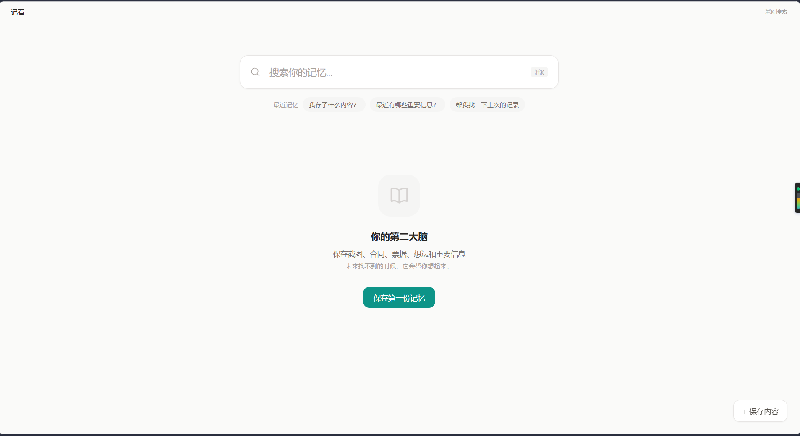
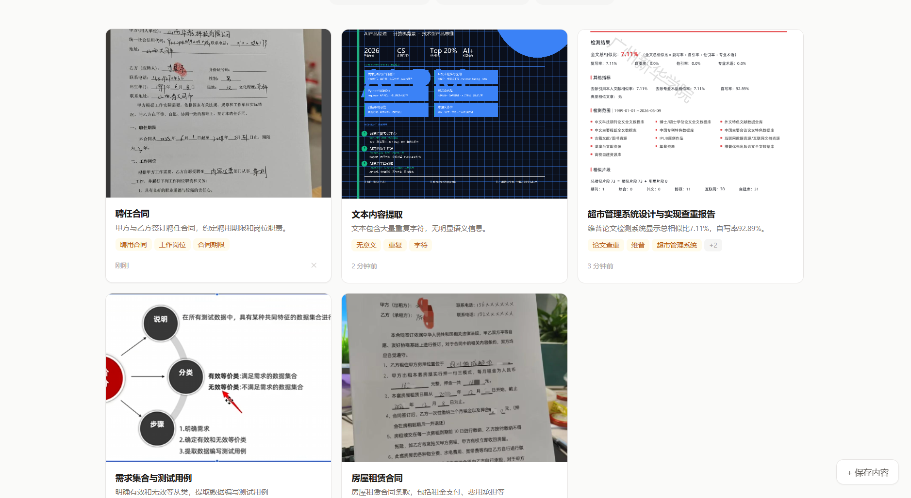
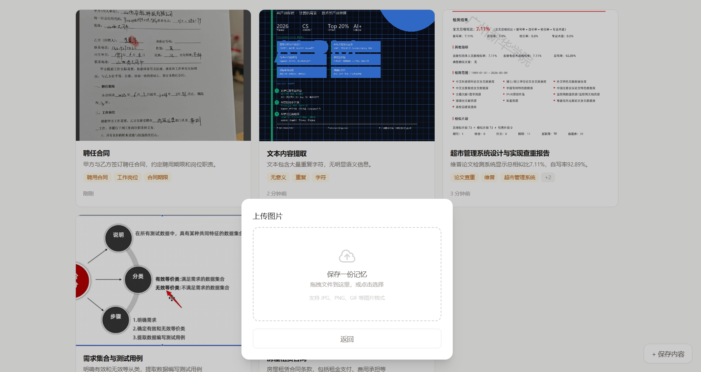
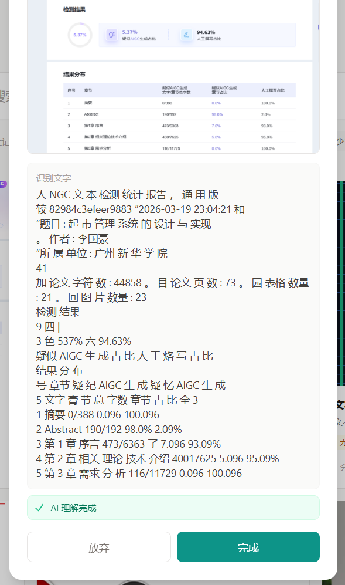
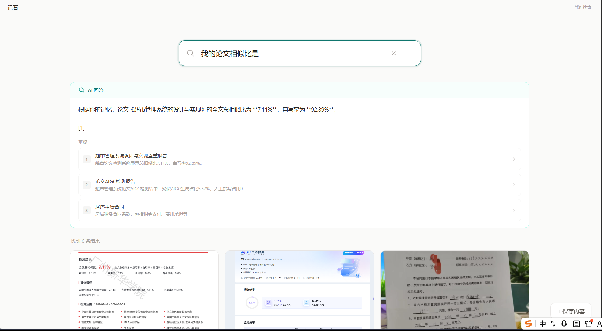
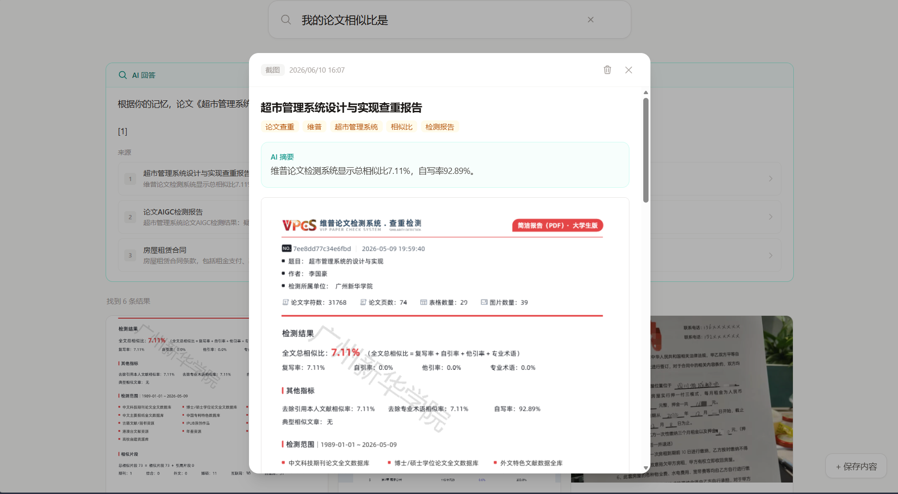
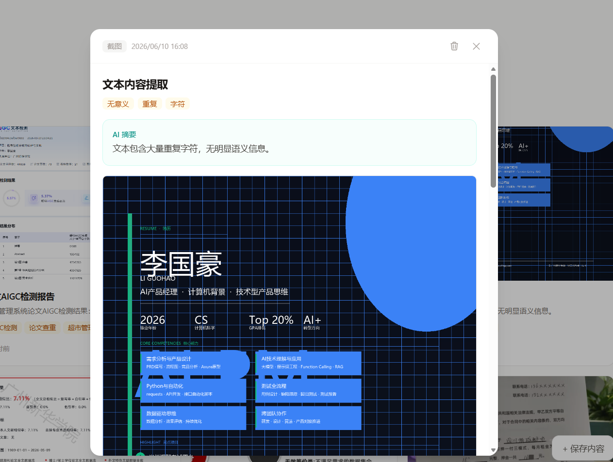
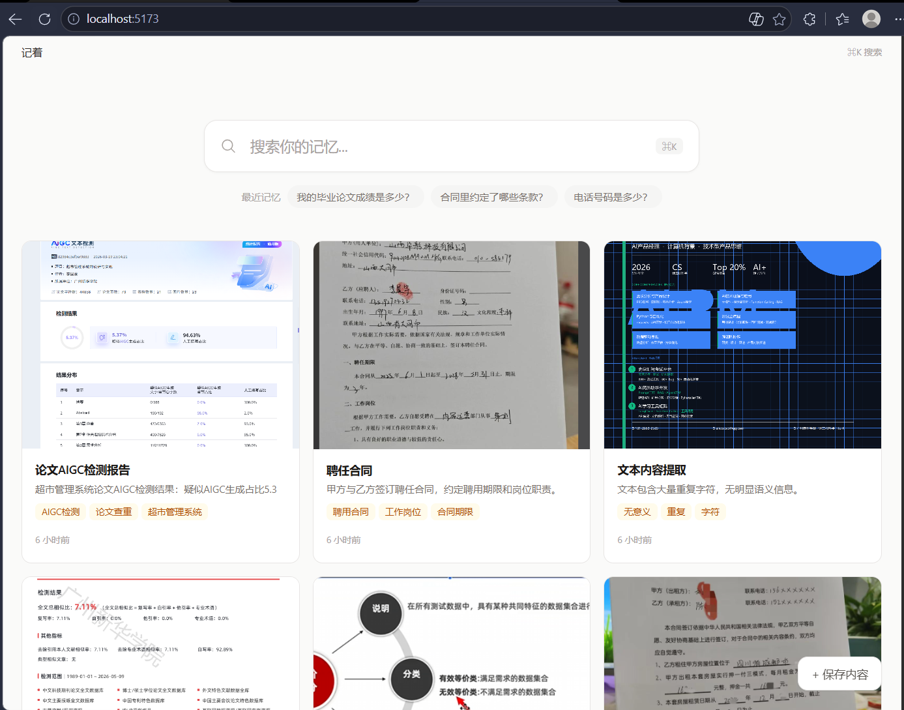

# 记着（JiZhe）

### AI Memory Search — 帮助用户重新找回自己保存过的信息

用户上传截图或文字。系统自动 OCR、AI 理解、结构化存储。未来只需问「房东当时说押金多少？」，AI 直接返回答案并引用原始来源。

---

## 项目背景

**我们每天都在截屏，但从来看不到第二眼。**

- 📸 看到重要信息 → 截图 → 混入几千张相册 → 再也找不到
- 🔍 微信只搜文字关键词，相册 OCR 不理解语义，笔记软件需要手动整理
- 😰 「万一以后要用」——不敢清理，但没有检索能力的存储只是负担

**产品假设：如果 AI 能在存入时自动理解内容，用户就完全不需要整理。**

---

## 产品方案

```
上传内容 → OCR 识别 → AI 理解 → 结构化记忆提取 → 本地存储 → 自然语言问答 → 答案 + 来源引用
```

---

## 核心功能

| 功能 | 说明 |
|---|---|
| OCR 识别 | tesseract.js 浏览器端运行，中文支持 |
| AI 结构化记忆 | DeepSeek API 自动提取标题、摘要、标签、实体字段 |
| 标签生成 | 自动关键词标签，零手动整理 |
| AI 问答 | 基于真实记忆的自然语言问答，引用原始来源 |
| 来源引用 | 每条 AI 答案附带原始截图引用，可点击验证 |
| OCR 失败兜底 | 无法提取文字时提供关键词输入框，不让任何记忆沉没 |

---

## 产品截图

| 空状态 | 记忆卡片墙 | 拖拽上传 |
|---|---|---|
|  |  |  |

| OCR + AI | AI 问答 | 结构化详情 |
|---|---|---|
|  |  |  |

| OCR 兜底 | 完整首页 |
|---|---|
|  |  |

---

## 产品迭代

| 版本 | 核心能力 | 关键决策 |
|---|---|---|
| V1 | OCR 搜索 | 验证「存入 → 找到」闭环可行 |
| V2 | AI 关键词提取 | Ollama 本地→DeepSeek 云端，速度 300s→3s |
| V3 | AI 问答 | 从「搜关键词」到「问问题」，增加来源引用 |
| V4 | 结构化记忆 | 实体提取让回答从「良好」变为「81 分，良好」 |

---

## 技术栈

- **前端**：React + Vite + Tailwind CSS
- **OCR**：tesseract.js（浏览器端运行）
- **AI**：DeepSeek API（标题/摘要/标签/实体 + 问答）
- **存储**：localStorage（MVP），后续迁移至 SQLite + Electron
- **本地优先**：所有数据存储在用户设备，不上传云端

---

## 项目反思

### 1. OCR 不稳定问题
tesseract.js 在复杂背景、竖排文字、手写体上准确率波动大。解决方案：OCR 从核心依赖降级为辅助能力，失败时提供关键词兜底，建立优雅降级链。

### 2. 为什么增加人工补充关键词
即使 OCR 完全失败，用户手动输入几个词后，内容仍能被搜索和 AI 召回。设计哲学：不让任何一条记忆「沉没」。

### 3. 为什么答案必须引用来源
AI 产品最大的风险是幻觉导致信任崩塌。每条 AI 回答下方列出引用记忆（编号 + 标题），点击可查看原始截图。来源引用不是功能，是信任基础设施。

### 4. 产品设计中的关键取舍
- **「不做」比「做」更难**：拒绝分类、拒绝知识图谱、拒绝 Agent——每次「不做」都在保护核心承诺：零整理
- **Ollama 本地模型是错误决策**：2.3GB 下载 + 300s 推理 → 切换 DeepSeek API，30 分钟完成，3s 响应。验证阶段速度优先于本地化
- **如果重新做，先做问答后做 OCR**：核心差异化是问答，不是文字识别

---

## 未来规划

- **时间维度记忆**：自动构建个人时间线
- **主动提醒**：基于日期和截止时间推送
- **多格式支持**：PDF、合同、发票的结构化提取
- **桌面应用化**：Electron 打包，SQLite 替换 localStorage

---

## 作品集

完整产品案例研究：[case-study/index.html](case-study/index.html)

包含：竞品分析 · 产品流程图 · 关键决策详解 · 项目复盘

---

## 本地运行

```bash
npm install
# 复制 .env.example 为 .env，并填写 AI_BASE_URL / AI_API_KEY
npm run dev
```

打开 `http://localhost:5173`

---

**记着 · AI Memory Search · 个人项目 · 2026**
---

## Cloudflare Pages 部署

构建配置：

```text
Build command: npm run build
Build output directory: dist
Root directory: /
```

Cloudflare Pages 环境变量需要填写：

```text
AI_BASE_URL=https://your-provider.example/v1
AI_API_KEY=your_api_key_here
VITE_AI_MODEL=gpt-5.5
VITE_AI_TEXT_MODEL=gpt-5.5
VITE_AI_VISION_MODEL=gpt-5.5
```

如果图片识别和文本模型使用不同中转站，再额外填写：

```text
AI_VISION_BASE_URL=https://your-vision-provider.example/v1
AI_VISION_API_KEY=your_vision_api_key_here
```

注意：真实 API key 只放 Cloudflare Pages 的环境变量，不要提交到 GitHub，也不要写进前端代码。
